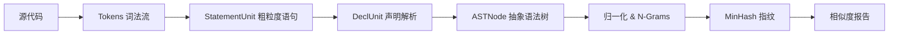

# C Clone Detector (CCD)


写给 **C 语言初学者** 的代码查重系统实现教程。

A C-based Code Clone Detector built from scratch for educational purposes.


**CCD** 是一个 **完全使用 C 语言** 从零编写的代码查重工具。

它不依赖任何复杂的第三方库，旨在通过构建一个实际的工程，帮助初学者彻底掌握 C 语言的核心特性与工程化开发方法。

点击进入：[完整开发教程](docs/intro.md)

---

## 为什么要做这个项目？

这不仅仅是为了做一个查重工具，而是为了 **打通 C 语言的任督二脉**：

*   **告别“野路子”**：你将学会 `CMake` 构建、模块化编程、头文件管理，而不是把所有代码塞进 `main.c`。
*   **掌握内存的艺术**：C 语言没有 `vector`？我们自己写一个支持泛型的动态数组！彻底理解 `malloc`、`free` 和内存泄漏。
*   **数据结构实战**：链表、哈希表、树……这些课本上的概念，在这里是你解决问题的唯一武器。
*   **接触核心算法**：了解业界如何使用 MinHash 处理海量文本相似度，从“做题家”转变为“工程师”。

---

## 核心流水线

这是本项目的 **核心架构**，也是你将要实现的功能：



1.  **Tokenizer**: 把 `int a = 1;` 切分为 `[INT, ID, ASSIGN, NUM, SEMI]`。
2.  **StatementUnit**: 利用 `{}` 和 `;` 进行粗略分块，先不管里面是声明还是表达式，把骨架提取出来。（抗代码混淆第一步）
3.  **DeclUnit & Symbol Table**: 建立符号表，能够区分 `T * a;` 到底是“指针声明”还是“乘法运算”。
4.  **ASTNode**: （待完成）构建完整的语法树，理解 `if/else/while` 逻辑结构。
5.  **N-Grams + MinHash**: （待完成）将树结构转化为数学特征向量，利用概率算法在海量代码中秒出查重结果。

---

## 项目状态与路线图

- [x] **基础设施**: 动态数组 Vector、哈希表 HashMap。
- [x] **词法分析**: 完整的 `Tokenizer` 词法解析，支持 C98 关键字。
- [x] **粗粒度扫描**: `StatementUnit` 划分 (`Compound`, `Loop`, `If`, etc.)。
- [x] **声明解析**: `DeclUnit` 与复杂的声明符解析 (指针/数组/函数嵌套)。
- [ ] **语法树构建**: 将 `DeclUnit` 转化为精细的 AST（抽象语法树）。
- [ ] **指纹算法**: 实现 N-gram 滑动窗口与 MinHash 估值。

--- 

## 快速开始

你需要一个 C 编译器 (GCC/Clang) 和 CMake。

```bash
# 1. 下载项目
git clone https://github.com/pjh456/ccd.git
cd ccd

# 2. 建立构建目录（保持源码整洁）
mkdir build && cd build

# 3. 编译
cmake ..
make

# 4. 运行工具（目前阶段）
./ccd_cli -U ../tests/test_code.c  # 查看粗粒度单元划分
```

---

## 目录结构

```txt
ccd/
├── docs/                 # 循序渐进的文字教程（核心部分！）
├── include/              # 头文件（对外接口，告诉别人“我有什么”）
├── src/                  # 源文件（内部实现，告诉机器“怎么做”）
├── tests/                # 测试用例（保证代码没写挂）
└── CMakeLists.txt        # 项目的“说明书”
```

## 参与贡献

如果你在学习过程中发现了 Bug，或者觉得教程哪里没讲清楚，欢迎提交 Issue 或 PR！

### License

MIT License.

完全开源！