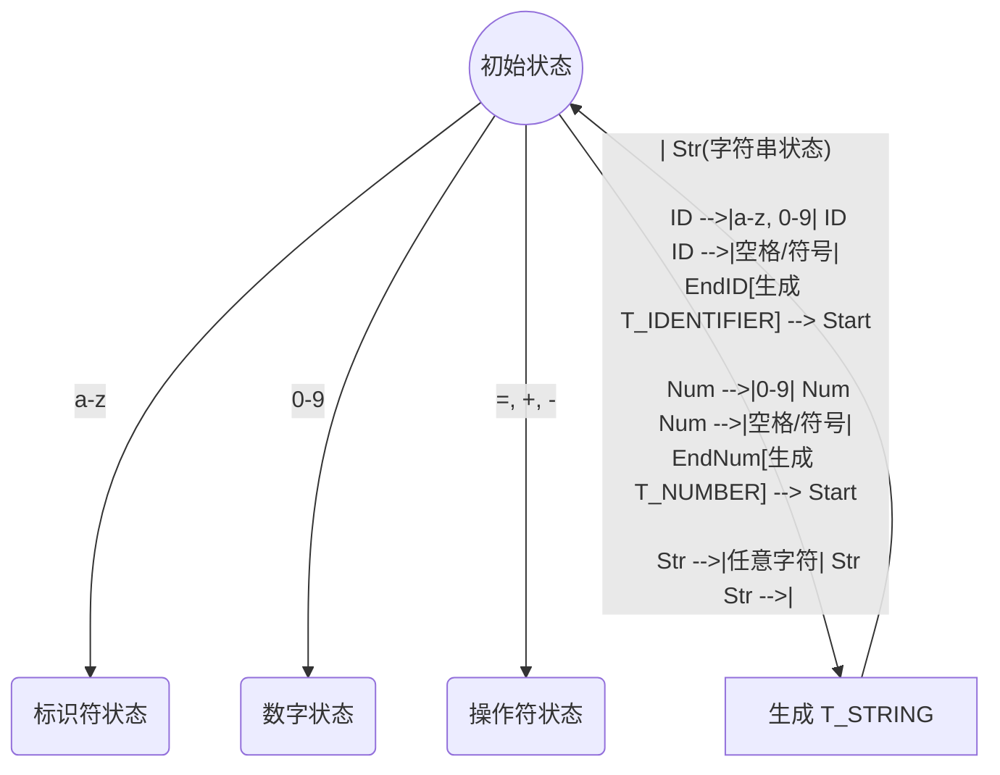

# 08. 教计算机“识字”：词法分析 (Tokenizer) 与状态机

**本章目标**：

1.  **核心痛点**：为什么不能简单地用 `split(' ')` 来切割代码？
2.  **输入输出**：明确 Tokenizer 的工作是将无意义的 `char` 流转换为有意义的 `Token` 流。
3.  **理论基础**：理解 **有限状态机 (FSM)** —— 这是我们将字符流组装成单词的万能钥匙。

---

## 1. 人类 vs 计算机：阅读方式的差异

请看这行代码：
```c
int age = 18;
```

**人类（你）** 读这段代码时，一眼就能看出四个部分：
1.  `int` (关键字)
2.  `age` (变量名)
3.  `=` (运算符)
4.  `18` (数字)

**计算机（程序）** 读这段代码时，它看到的是什么？
它看到的是一个**字符数组**，或者说是一堆冰冷的 ASCII 码：
```c
['i', 'n', 't', ' ', 'a', 'g', 'e', ' ', '=', ' ', '1', '8', ';', '\0']
```

**词法分析器 (Tokenizer)** 的工作，就是充当“翻译官”，把这堆字符（Char），组装成 **Token** 对象。

---

## 2. 为什么不能用空格切割？

很多初学者会问：“我直接按空格切割字符串不就行了吗？”

对于 `int age = 18;` 来说，好像是可以的。但在 C 语言中，空格并不是必须的。
请看这段合法的 C 代码：

```c
// 这里的 b、*、( 之间完全没有空格
int a=10+b*(5-c);
```

如果你按空格切，整个字符串会被当成一个巨大的、无法识别的单词。
但在 Tokenizer 眼里，它必须被精准地切分成：
`int`, `a`, `=`, `10`, `+`, `b`, `*`, `(`, `5`, `-`, `c`, `)` ...

**结论**：我们需要一个能够逐个字符扫描，并自动判断“单词边界”的机器。

---

## 3. 核心武器：有限状态机 (FSM)

要解决这个问题，我们需要引入计算机科学中最经典的模型：**有限状态机 (Finite State Machine)**。

Tokenizer 在读取字符时，就像一个在地图上行走的机器人，它始终处于某种 **状态** 之中：
- **初始状态**：正在发呆，等待读入非空字符。
- **标识符状态**：刚才读了个字母，正在拼凑变量名。
- **数字状态**：刚才读了个数字，正在拼凑数值。

### 让我们模拟读取 `int a = 18;` 的过程：

#### 1. 初始状态 (Start)
- 光标指向 `'i'`。
- **动作**：检测到字母，切换到 **[标识符状态]**。

#### 2. 标识符状态 (In Identifier)
- 读取 `n` -> 是字母，继续保持状态，拼接到当前单词。
- 读取 `t` -> 是字母，继续保持。
- 读取 `' '` (空格) -> **边界！**
    - **动作**：空格不是标识符的一部分。说明刚才那个单词结束了。
    - **产出**：生成 Token `int` (类型: T_INT)。
    - **状态**：切换回 **[初始状态]**。

#### 3. 初始状态 (Start)
- 遇到空格，跳过。
- 光标指向 `'a'`。
- **动作**：检测到字母，切换到 **[标识符状态]**。

#### ... (中间省略 age 和 = 的过程) ...

#### 4. 数字状态 (In Number)
- 读到了 `1`，进入数字状态。
- 读取 `8` -> 是数字，继续保持。
- 读取 `;` -> **边界！**
    - **动作**：分号不是数字的一部分。
    - **产出**：生成 Token `18` (类型: T_NUMBER)。
    - **特殊处理**：`;` 本身也是一个 Token (T_SEMICOLON)，直接产出。
    - **状态**：切换回 **[初始状态]**。

### FSM 状态流转图



---

## 4. 贪婪匹配 (Greedy Match) 与 前瞻 (Peek)

这里有一个棘手的问题：**操作符的歧义**。

假设代码是 `a >= b`。
当 Tokenizer 读到 `>` 时，它应该立刻切分吗？

- 如果立刻切分，得到的是 `>` (T_GREATER)。
- 但下一个字符是 `=`，它们合起来是 `>=` (T_GREATER_EQUAL)。

**规则**：Tokenizer 通常是 **贪婪** 的。它会尽可能多地“吃”字符，直到组不成一个合法的 Token 为止。

这就需要 **前瞻 (Peek)** 能力：
1.  当前字符是 `>`。
2.  **偷看 (Peek)** 下一个字符：是 `=` 吗？
3.  如果是，那就把它也“吃”进来，合并成 `>=`，并将光标后移两位。
4.  如果不是（比如是 `a > b`），那就只切分 `>`，光标后移一位。

---

## 5. 设计 Tokenizer 的上下文 (Context)

为了实现上述逻辑，我们需要定义一个 `Tokenizer` 结构体来保存当前的“状态”。

根据你提供的 `make_token` 实现：
```c
Token *make_token(Tokenizer *tk, TokenType tt, const char *lit, size_t len) {
    // ...
    if (tk) {
        t->line = tk->stus.line;
        t->col = tk->stus.col;
    }
    // ...
}
```

我们可以推断出 `Tokenizer` 需要维护以下信息：

1.  **输入源代码** (`source`): 也就是那个巨大的 `char*` 字符串。
2.  **当前游标** (`cursor`): 指向 `source` 中当前正在解析的位置。
3.  **当前状态** (`stus`): 记录当前的行号 (`line`) 和列号 (`col`)。这对报错非常重要（例如：*"第 10 行缺少分号"*）。

这与我们在第 3 章定义的 `Token` 结构体形成了完美的配合：**`Tokenizer` 负责生产数据，`Token` 负责承载数据。**

---

### 下一章预告

理论课结束，开始写代码！

我们之前虽然定义了 `Token`，但还不够完善。下一章 **[09. 定义 Token 类型](09_enum_token_type.md)**，我们将扩充 `token.h`，利用枚举（Enum）列出 C 语言中所有的关键字 (`int`, `return`, `if`...) 和符号，并正式定义 `Tokenizer` 结构体。